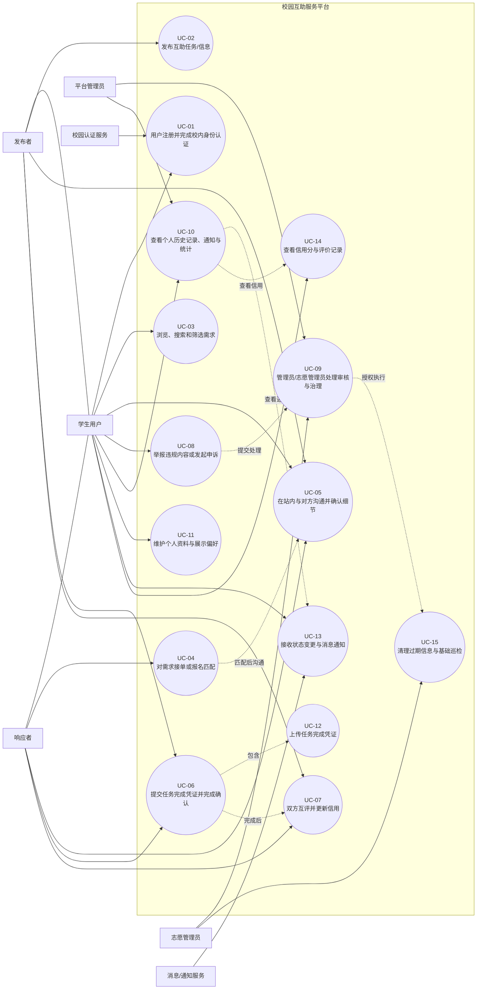

# 用例图 + 3 个详细用例描述

## 1. 系统级用例图

## 2. 用例清单

| 编号 | 用例名称 |
|---|---|
| UC-01 | 用户注册并完成校内身份认证 |
| UC-02 | 发布互助任务/信息 |
| UC-03 | 浏览、搜索和筛选需求 |
| UC-04 | 对需求接单或报名匹配 |
| UC-05 | 在站内与对方沟通并确认细节 |
| UC-06 | 提交任务完成凭证并完成确认 |
| UC-07 | 双方互评并更新信用 |
| UC-08 | 举报违规内容或发起申诉 |
| UC-09 | 管理员/志愿管理员处理审核与治理 |
| UC-10 | 查看个人历史记录、通知与统计 |
| UC-11 | 维护个人资料与展示偏好 |
| UC-12 | 上传任务完成凭证 |
| UC-13 | 接收状态变更与消息通知 |
| UC-14 | 查看信用分与评价记录 |
| UC-15 | 清理过期信息与基础巡检 |

---

## 3. 详细用例描述

### 3.1 UC-01 用户注册并完成校内身份认证

**用例目标**  
用户创建平台账号并通过校内身份校验，获得发布、接单和参与交易类场景的权限。

**主要参与者**  
学生用户

**次要参与者**  
校园认证服务、平台管理员

**前置条件**  
1. 用户尚未注册平台账号。  
2. 用户具备手机号、学号、校园邮箱或学校统一身份认证条件中的至少一种。  
3. 校园认证服务可用，或平台允许提交人工审核材料。

**基本流**  
1. 用户进入注册/登录页面。  
2. 系统提供手机号、邮箱、学号、校园邮箱或统一身份认证等注册方式。  
3. 用户输入注册信息并完成基础账号创建。  
4. 用户补充昵称、头像、学院/专业、年级等信息。  
5. 用户发起校内身份认证。  
6. 系统调用校园认证服务进行核验。  
7. 核验通过后，系统将账号状态更新为“已认证”。  
8. 系统开放发布高风险需求、接单和交易类功能权限。  
9. 系统向用户返回认证成功结果。

**替代流 / 异常流**  
- A1：用户输入信息不完整或格式错误，系统提示修正后重新提交。  
- A2：校园认证服务暂时不可用，系统提示稍后重试或转人工审核。  
- A3：认证未通过，系统保留基础账号，但维持“未认证”状态。  
- A4：用户选择匿名展示，系统仅在前台弱化展示真实身份，后台仍保留映射。  

**后置条件**  
1. 成功时，用户账号创建完成，认证状态为“已认证”。  
2. 失败时，用户仅能保留基础账号和公开浏览权限。  
3. 系统保留认证过程审计日志，便于后续追溯。

---

### 3.2 UC-02 发布互助任务/信息

**用例目标**  
发布者在平台上发布一条校内互助任务或信息，供其他用户浏览、匹配与响应。

**主要参与者**  
发布者

**次要参与者**  
平台管理员、志愿管理员、消息/通知服务

**前置条件**  
1. 发布者已登录平台。  
2. 发布者已完成校内身份认证。  
3. 系统已配置分类、标签、校区、敏感词与审核规则。  

**基本流**  
1. 发布者进入“发布”页面。  
2. 系统展示需求分类，如失物招领、快递/跑腿、二手交易、学习求助、资料分享、组队招募、拼单拼车、咨询问答等。  
3. 发布者填写标题、描述、地点、时间要求、附件、报酬说明、校区/范围等字段。  
4. 发布者选择标签，并设置是否匿名展示。  
5. 系统执行必填校验、敏感词检测和违规规则检查。  
6. 校验通过后，系统生成任务/信息记录。  
7. 系统将记录状态设为“待响应”或“待审核”。  
8. 记录加入可浏览列表，并向潜在响应用户发送通知。

**替代流 / 异常流**  
- B1：用户未认证但尝试发布高风险需求，系统拒绝发布并提示先完成 UC-01。  
- B2：内容命中敏感词或违规规则，系统阻止提交并转人工审核。  
- B3：发布者选择匿名或半匿名发布，系统限制适用范围并增加审核。  
- B4：附件上传失败，系统提示重新上传，并保留已填写文本内容为草稿。  

**后置条件**  
1. 成功时，任务/信息被保存并进入展示或审核流程。  
2. 失败时，不生成正式发布记录，仅保存草稿或错误日志。  
3. 发布者可以在个人中心查看该记录及其状态。

---

### 3.3 UC-09 管理员/志愿管理员处理审核与治理

**用例目标**  
管理员或志愿管理员依据平台规则完成审核、下架、巡检、举报申诉处理和秩序维护。

**主要参与者**  
平台管理员

**次要参与者**  
志愿管理员、消息/通知服务

**前置条件**  
1. 管理员或志愿管理员已登录后台。  
2. 系统中存在待审核认证、待处理举报/申诉、违规内容或过期信息。  
3. 平台治理规则、敏感词库与审计日志机制已启用。

**基本流**  
1. 管理员进入治理后台。  
2. 系统展示待处理事项列表，如认证审核、举报申诉、违规内容、异常订单、过期信息。  
3. 管理员打开具体事项，查看聊天记录、完成凭证、举报证据和历史记录。  
4. 系统提供通过、驳回、下架、封禁、恢复、备注等处理动作。  
5. 管理员作出处理决定。  
6. 系统更新对象状态，并记录处理人、处理时间与处理原因。  
7. 如事项属于基础巡检或过期信息清理，管理员可授权志愿管理员处理。  
8. 系统向相关用户发送处理结果通知，并更新统计数据。

**替代流 / 异常流**  
- C1：证据不足，管理员退回事项并通知提交方补充材料。  
- C2：志愿管理员尝试处理超出权限的事项，系统拒绝并转交平台主管理员。  
- C3：申诉成立，系统撤销原处罚、恢复内容或修正评价。  
- C4：发现恶意违规或高风险行为，系统立即限制账号发布、接单或沟通能力。  

**后置条件**  
1. 事项处理完成后，相关状态、日志和通知同步更新。  
2. 若未处理完毕，事项保持“待补证”或“处理中”状态。  
3. 平台治理数据可用于后续统计与审计。
