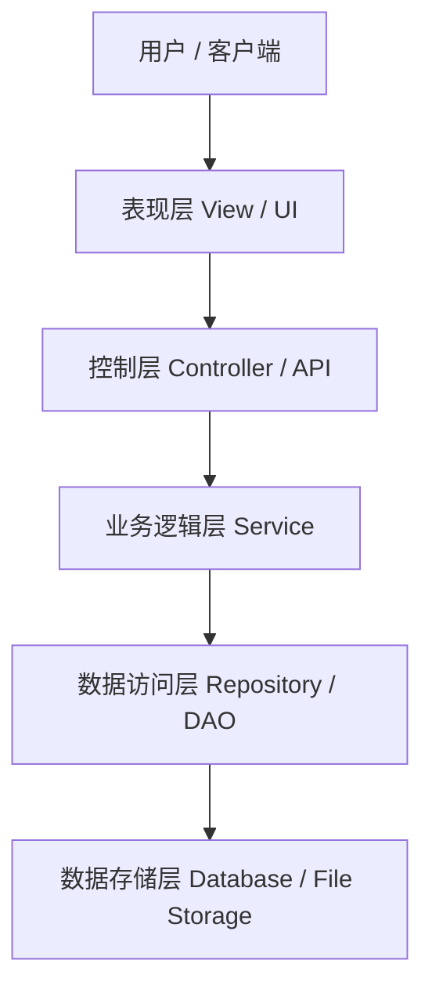

# "架构辩论赛"记录
## 1. 成员A：直接问"推荐什么架构"
### 一、Prompt
文件中是我们的项目要求，对于我们的项目，你推荐什么架构？
### 二、AI的回答
直接给你最适合作业、最容易拿分、10周内能做完的架构方案。

一、最优架构：前后端分离架构（文档明确建议）

前端 + 后端 + 数据库 三层分离，完全匹配作业要求。

1. 推荐技术栈（标准版，好开发、好演示）

• 前端：Vue3 + Vite + Element Plus / Vant

• 后端：SpringBoot（Java）或 Flask（Python）

• 数据库：MySQL 8

• 接口：RESTful API

• 文档：Swagger 自动生成

2. 架构分层

1. 前端层：页面、组件、路由、网络请求

2. API 接口层：前后端通信入口

3. 业务逻辑层：用户、需求、订单、评价核心逻辑

4. 数据访问层：数据库 CRUD

5. 数据层：MySQL 存储用户、需求、订单、评价
二、为什么必须选这个架构

1. 符合文档要求：作业明确写“建议前后端分离”

2. 开发最快：AI 能一键生成 CRUD、接口、页面

3. 团队好分工：4人可并行做前端/后端/数据库/测试

4. 满足非功能需求：性能、安全、可维护性都达标

5. 10周完全能做完：240人时刚好够开发与调试
三、最简可落地架构（基础弱也能稳过）

如果你团队技术一般，直接用这个最简架构：

• 前端：Vue3 + 简单页面

• 后端：Flask（Python）

• 数据库：MySQL

• 只做核心接口：用户、需求、订单、评价

优点：代码少、上手快、AI 辅助极强，P0 必做功能稳完成。
四、不推荐的架构（别踩坑）

• 微服务：太重，240人时根本做不完

• 单体 MVC：前后端耦合，分工差

• 低代码/无代码：不符合软件工程实训目的
五、最终结论

CampusHub 唯一最优架构：前后端分离（Vue3 + SpringBoot/Flask + MySQL）

要不要我帮你把这个架构写成标准架构设计文档，直接可交作业？
## 2. 成员 B：提供详细项目约束后问

### 一、用户问题（Prompt）

你现在扮演一名软件架构师，帮助我们的软件工程课程项目进行系统架构设计。

#### 项目背景

- 这是一个软件工程课程团队项目
- 团队共有 4 人，角色包括：需求负责人、架构负责人、开发负责人、测试负责人
- 当前处于项目启动与架构设计早期阶段
- 项目目标是完成一个可演示、可迭代、适合课程作业要求的软件系统
- 团队成员技术能力有限，因此架构设计需要清晰、易理解、易实现、易测试
- 当前重点是确定项目的整体架构风格，而不是直接生成完整代码

#### 需要完成的任务

1. 分析本项目适合采用哪种软件架构风格
2. 对比 MVC、分层架构、微服务架构、事件驱动架构等常见架构风格
3. 说明每种架构风格的优点、缺点以及是否适合本课程项目
4. 最终推荐一种最适合我们项目的架构方案
5. 说明选择该架构的原因
6. 说明该架构中各层或各模块的职责
7. 说明该架构如何支持后续开发、测试和维护
8. 给出一个适合该架构的模块划分示例

#### 架构设计约束

1. 架构必须适合学生团队和课程项目，不能过度设计
2. 优先选择易实现、易理解、易测试、易维护的方案
3. 不建议使用微服务、复杂事件驱动、分布式架构等过重方案，除非有充分理由
4. 架构应支持团队成员分工协作
5. 架构应方便后续撰写需求文档、架构设计文档、测试文档
6. 架构应方便后续接入基础测试和 CI 检查
7. 不要只给概念解释，要给出可以落地到课程项目中的结构建议
8. 如果项目信息不足，请基于“普通中小型课程项目”的假设进行最保守、最合理的架构建议，并明确说明你的假设

#### 输出格式要求

1. 项目架构设计目标
2. 常见架构风格对比表，包括 MVC、分层架构、微服务架构、事件驱动架构
3. 推荐架构风格
4. 推荐理由
5. 架构层次或模块划分
6. 各层/模块职责说明
7. 该架构对开发、测试、维护的帮助
8. 不选择其他架构风格的原因
9. 可用于架构设计文档的正式表述版本

---

### 二、回答整理

#### 1. 项目架构设计目标

根据项目背景和约束条件，本项目的架构设计目标不是追求复杂或企业级架构，而是选择一种适合课程项目、小团队协作和后续迭代开发的架构方案。

本项目架构设计应达到以下目标：

1. **清晰易懂**：团队成员能够快速理解系统由哪些部分组成，以及各部分之间如何协作。
2. **易于实现**：架构不应引入过多复杂技术，避免增加开发难度。
3. **便于分工**：能够支持需求、架构、开发、测试四个角色围绕模块开展工作。
4. **便于测试**：系统结构应方便后续进行单元测试、接口测试和功能测试。
5. **便于维护和扩展**：后续新增功能时，不需要大规模修改已有代码。
6. **便于文档编写**：架构结构应能清楚地写入需求文档、架构设计文档和测试文档。
7. **适合课程展示**：架构应能支持项目演示、代码检查、文档验收和 CI 基础检查。

由于当前没有提供具体业务类型，以下分析基于“普通中小型课程项目 / Web 应用 / 信息管理类系统”的保守假设进行。

---

#### 2. 常见架构风格对比表

| 架构风格 | 基本含义 | 优点 | 缺点 | 是否适合本课程项目 |
|---|---|---|---|---|
| MVC 架构 | 将系统划分为 Model、View、Controller 三部分，分别负责数据模型、界面展示和请求控制 | 结构清晰，容易理解；适合 Web 项目；便于前后端或页面逻辑分离 | 对复杂业务的层次划分不够细；如果项目变大，Controller 可能变得臃肿 | 比较适合，尤其适合页面展示和请求处理较清晰的 Web 项目 |
| 分层架构 | 将系统按照职责划分为表现层、业务逻辑层、数据访问层、数据存储层等 | 职责清楚，易于实现，易于测试，适合中小型项目；便于团队分工 | 如果层次划分不合理，可能出现代码重复或层间调用混乱 | 非常适合，是本项目最推荐的整体架构 |
| 微服务架构 | 将系统拆分为多个独立服务，每个服务独立开发、部署和维护 | 适合大型复杂系统；服务独立性强；便于扩展和独立部署 | 技术复杂度高，需要服务治理、接口通信、部署运维等能力；对学生团队成本较高 | 不推荐，明显超出普通课程项目需要 |
| 事件驱动架构 | 系统通过事件发布和事件监听来驱动模块协作 | 适合异步处理、高并发、消息通知、实时系统等场景；模块解耦较强 | 理解和调试难度较高；需要消息队列或事件机制支撑；流程不直观 | 一般不推荐，除非项目明确需要大量异步事件处理 |

---

#### 3. 推荐架构风格

推荐本项目采用：

**分层架构为主，结合 MVC 思想的轻量级架构方案。**

也就是说，从整体系统结构上采用分层架构，将系统划分为表现层、控制层、业务逻辑层、数据访问层和数据存储层；在具体请求处理和页面交互中，可以参考 MVC 思想，将界面展示、请求控制和数据模型进行分离。

这种方案比单纯 MVC 更适合写进架构设计文档，也比微服务和事件驱动更适合学生团队落地。

---

#### 4. 推荐理由

##### 4.1 适合中小型课程项目

本项目是软件工程课程项目，团队规模为 4 人，目标是完成可演示、可迭代的软件系统。分层架构结构简单、职责清楚，不需要复杂的部署和运维能力，适合学生团队在有限时间内实现。

##### 4.2 易理解、易实现

分层架构可以把系统拆成几个清楚的部分，例如界面展示、请求处理、业务规则、数据访问和数据存储。每一层的职责相对明确，团队成员更容易理解系统整体结构。

##### 4.3 便于团队分工

不同角色可以围绕架构开展工作：

- 需求负责人可以将功能需求映射到具体模块
- 架构负责人可以设计层次关系和模块边界
- 开发负责人可以按照分层结构组织代码
- 测试负责人可以根据不同层次设计测试用例

##### 4.4 便于测试

分层架构天然支持测试拆分。例如：

- 表现层可以做功能测试或页面测试
- 控制层可以做接口测试
- 业务逻辑层可以做单元测试
- 数据访问层可以做数据库相关测试

这有利于后续接入基础 CI 检查。

##### 4.5 便于维护和扩展

后续如果新增功能，可以按照已有层次添加对应模块，而不是把所有逻辑都堆在一个地方。这样能减少代码混乱，也方便后续维护。

##### 4.6 便于文档表达

分层架构可以很清楚地写入架构设计文档，包括架构图、层次说明、模块职责和调用关系。对于课程作业来说，这种结构更容易被老师理解和检查。

---

#### 5. 架构层次或模块划分

推荐采用如下逻辑层次：

```text
用户 / 浏览器 / 客户端
        ↓
表现层（View / UI）
        ↓
控制层（Controller / API 接口）
        ↓
业务逻辑层（Service）
        ↓
数据访问层（Repository / DAO）
        ↓
数据存储层（Database / File Storage）
```

如果项目是 Web 应用，也可以理解为：

```text
前端页面
  ↓
后端接口
  ↓
业务服务
  ↓
数据库操作
  ↓
数据库
```

---

#### 6. 各层 / 模块职责说明

##### 6.1 表现层（View / UI）

表现层负责与用户交互，展示页面或界面内容，收集用户输入，并将用户操作发送给后端或控制层。

主要职责包括：

- 展示系统页面
- 收集用户输入
- 显示操作结果
- 进行简单的前端校验
- 调用后端接口

示例：登录页面、首页、功能列表页、详情页、表单页面等。

##### 6.2 控制层（Controller / API）

控制层负责接收用户请求，调用业务逻辑层处理请求，并返回处理结果。

主要职责包括：

- 接收前端请求
- 校验请求参数
- 调用对应的业务逻辑
- 返回统一格式的响应结果

示例：用户登录接口、查询列表接口、新增数据接口、删除数据接口等。

##### 6.3 业务逻辑层（Service）

业务逻辑层是系统的核心，负责实现具体业务规则。

主要职责包括：

- 处理核心业务逻辑
- 判断业务规则是否满足
- 协调多个数据访问操作
- 返回业务处理结果

示例：登录验证、数据审核、状态变更、权限判断、统计计算等。

##### 6.4 数据访问层（Repository / DAO）

数据访问层负责与数据库或文件系统交互，对外提供统一的数据操作接口。

主要职责包括：

- 查询数据
- 新增数据
- 修改数据
- 删除数据
- 屏蔽底层数据库操作细节

示例：用户数据查询、项目数据保存、记录删除、列表分页查询等。

##### 6.5 数据存储层（Database / File Storage）

数据存储层负责保存系统运行所需的数据。

主要职责包括：

- 存储用户信息
- 存储业务数据
- 存储日志或文件资源
- 保证数据可持久化

示例：MySQL、SQLite、PostgreSQL、MongoDB、JSON 文件、图片文件夹等。

---

#### 7. 模块划分示例

在具体业务尚未完全确定的情况下，可以采用通用模块划分方式：

```text
系统模块
├── 用户模块
│   ├── 用户注册
│   ├── 用户登录
│   ├── 用户信息管理
│   └── 权限基础控制
│
├── 核心业务模块
│   ├── 业务数据创建
│   ├── 业务数据查询
│   ├── 业务数据修改
│   └── 业务数据删除
│
├── 统计 / 展示模块
│   ├── 数据概览
│   ├── 列表展示
│   └── 简单统计
│
├── 系统管理模块
│   ├── 基础配置
│   ├── 日志记录
│   └── 异常处理
│
└── 测试模块
    ├── 单元测试
    ├── 接口测试
    └── 功能测试
```

如果后续项目业务明确，可以将“核心业务模块”替换为具体业务名称。例如：

- 图书管理项目：图书模块、借阅模块、用户模块
- 校园服务项目：服务发布模块、预约模块、评价模块
- 任务管理项目：任务模块、项目模块、成员模块
- 课程管理项目：课程模块、作业模块、成绩模块

---

#### 8. 该架构对开发、测试、维护的帮助

##### 8.1 对开发的帮助

分层架构可以让开发负责人按照层次组织代码，避免所有代码混在一起。开发时可以按照模块或层次进行任务分配，例如一个成员负责前端页面，一个成员负责后端接口，一个成员负责业务逻辑，一个成员负责测试和文档。

该架构还能帮助团队明确代码应该放在哪里。例如：页面展示代码放在表现层，请求处理代码放在控制层，业务规则放在业务逻辑层，数据库操作放在数据访问层。

##### 8.2 对测试的帮助

测试负责人可以根据架构层次设计不同类型的测试：

- 针对业务逻辑层设计单元测试
- 针对控制层设计接口测试
- 针对表现层设计功能测试
- 针对数据访问层设计数据读写测试

这样测试工作更有针对性，也方便后续配置 CI 流水线进行自动检查。

##### 8.3 对维护的帮助

当系统出现问题时，团队可以根据错误位置快速定位是哪一层的问题。例如：

- 页面显示错误，优先检查表现层
- 接口返回错误，优先检查控制层
- 业务结果不符合预期，优先检查业务逻辑层
- 数据没有保存成功，优先检查数据访问层或数据库

这种结构能降低排查问题的难度。

##### 8.4 对需求管理的帮助

需求负责人可以将每个功能需求映射到具体模块。例如“用户登录”可以对应用户模块中的登录功能；“查询业务数据”可以对应核心业务模块中的查询功能。这样可以让需求文档、设计文档和测试用例之间形成对应关系。

---

#### 9. 不选择其他架构风格的原因

##### 9.1 不选择单纯 MVC 的原因

MVC 架构适合 Web 项目，但如果只使用 MVC，容易把过多业务逻辑写进 Controller，导致 Controller 变得臃肿。对于课程项目而言，单纯 MVC 可以作为思想参考，但更推荐在整体上使用分层架构，把业务逻辑层和数据访问层单独划分出来。

因此，本项目不建议只写成“纯 MVC 架构”，而是建议采用“分层架构 + MVC 思想”。

##### 9.2 不选择微服务架构的原因

微服务架构适合大型复杂系统，通常需要多个独立服务、服务通信、接口治理、部署运维、日志监控等配套能力。对于 4 人课程项目来说，微服务会显著增加理解和开发成本，容易导致团队把精力浪费在复杂配置上，而不是完成核心功能。

因此，本项目不推荐采用微服务架构。

##### 9.3 不选择事件驱动架构的原因

事件驱动架构适合大量异步消息、实时通知、高并发处理等场景。但普通课程项目通常没有这么复杂的事件处理需求。如果强行采用事件驱动，会增加理解、调试和测试难度。

因此，除非项目明确需要大量异步事件或消息通知，否则不推荐采用事件驱动架构。

##### 9.4 不选择复杂分布式架构的原因

复杂分布式架构通常需要服务拆分、网络通信、部署环境、容错机制和监控系统等支持。这些内容超出了普通软件工程课程项目的重点，不利于初学者团队快速落地。

因此，本项目不采用复杂分布式架构。

---

#### 10. 文字版架构图

##### 10.1 树状结构版

```text
系统整体架构
├── 表现层 View / UI
│   ├── 页面展示
│   ├── 用户输入
│   └── 前端交互
│
├── 控制层 Controller / API
│   ├── 请求接收
│   ├── 参数校验
│   └── 响应返回
│
├── 业务逻辑层 Service
│   ├── 业务规则处理
│   ├── 功能流程控制
│   └── 核心逻辑实现
│
├── 数据访问层 Repository / DAO
│   ├── 数据查询
│   ├── 数据新增
│   ├── 数据修改
│   └── 数据删除
│
└── 数据存储层 Database / File Storage
    ├── 用户数据
    ├── 业务数据
    └── 文件资源
```

##### 10.2 Mermaid 架构图



---

#### 11. 四个角色如何围绕该架构协作

| 角色 | 主要工作 | 与架构的关系 |
|---|---|---|
| 需求负责人 | 整理项目目标、功能需求、用户故事、用例描述、验收标准 | 将需求映射到具体模块，明确每个模块要实现什么功能 |
| 架构负责人 | 设计系统层次、模块边界、技术选型和架构文档 | 负责确定分层结构、模块关系和接口设计原则 |
| 开发负责人 | 组织代码实现、制定编码规范、完成核心功能开发 | 按照分层结构组织代码，保证代码职责清晰 |
| 测试负责人 | 制定测试策略、编写测试用例、进行质量检查 | 根据不同层次设计单元测试、接口测试和功能测试 |

---

#### 12. 可用于架构设计文档的正式表述版本

本项目采用以分层架构为主、结合 MVC 思想的轻量级架构方案。系统整体划分为表现层、控制层、业务逻辑层、数据访问层和数据存储层。表现层负责用户界面展示与用户交互，控制层负责接收请求并调用相应业务逻辑，业务逻辑层负责处理系统核心业务规则，数据访问层负责封装数据库或文件系统操作，数据存储层负责持久化保存系统运行所需的数据。

选择该架构的主要原因是：本项目属于中小型软件工程课程项目，团队规模较小，成员技术能力有限，因此需要一种结构清晰、易于理解、易于实现、易于测试和维护的架构方案。相比微服务架构和事件驱动架构，分层架构不需要复杂的服务治理、消息机制或分布式部署环境，更适合课程项目快速落地。同时，结合 MVC 思想可以进一步明确界面展示、请求控制和数据模型之间的关系，有助于提高代码结构的清晰度。

该架构能够支持团队分工协作。需求负责人可以将功能需求映射到具体业务模块，架构负责人可以根据分层结构设计模块边界和接口关系，开发负责人可以按照层次组织代码实现，测试负责人可以针对不同层次设计单元测试、接口测试和功能测试。后续项目迭代时，团队可以在不破坏整体结构的前提下新增模块或扩展功能，从而提高项目的可维护性和可扩展性。

综上，本项目不采用微服务、复杂事件驱动或分布式架构，而是选择更加轻量、稳定、清晰的分层架构方案，以满足课程项目在可实现性、可测试性、可维护性和文档表达方面的要求。

---

### 三、简短结论

对于本软件工程课程项目，最推荐的架构方案是：

**分层架构为主，结合 MVC 思想。**

该方案适合 4 人学生团队，结构清晰，方便理解、开发、测试、维护和撰写课程文档。微服务和事件驱动架构虽然更适合大型复杂系统，但对当前课程项目来说复杂度过高，不建议作为首选。

## 3. 成员 C：要求 AI 对比多种方案的优劣
### 一、Prompt
我是一名软件工程的大二学生，正在制作一个校园互助服务平台，我们是四人团队并且还有十周的时间完成这个项目，现在正在确定项目的架构风格，请你帮我对比MVC、分层、微服务、事件驱动这几种方案的优劣。
### 二、AI的回答

#### 1. MVC 架构（Model-View-Controller）

##### 适用场景
- Web 项目、前后端分离、CURD 为主的系统
- 校园平台几乎天生适合 MVC

##### 优点
- 结构清晰，大二完全能理解、能落地
- 职责分离：
  - Controller：接收请求、参数校验
  - Service：业务逻辑
  - Dao/Mapper：数据库操作
- 配合 SpringBoot 开箱即用，开发极快
- 适合 3～6 人小团队
- 方便写文档、画架构图

##### 缺点
- 业务复杂后 Controller 或 Service 会膨胀
- 不适合超高并发、分布式场景

##### 对你们：
- 非常适合，是基础必选结构

## 2. 分层架构（三层架构 / N-tier）

##### 分层
- 表现层 → 业务逻辑层 → 数据访问层

##### 优点
- 最稳定、最成熟、最不容易翻车
- 模块解耦，更换数据库 / 框架不影响上层
- 代码规范，老师最喜欢这种架构
- 4 人协作非常清晰：
  - 2 人写后端 service + controller
  - 1 人写数据库 + mapper
  - 1 人前端 / 联调

##### 缺点
- 不够 "高大上"，没有分布式亮点
- 高并发下扩展性一般

##### 对你们：
- 完美匹配，10 周绝对能做完，风险最低

#### 3. 微服务架构（Microservices）

##### 优点（听起来很强）
- 服务独立：用户服务、帖子服务、订单服务…
- 可独立扩展、独立部署
- 面试 / 论文好听

##### 缺点（对你们是致命级）
- 学习成本极高：
  - 服务注册发现、网关、配置中心、链路追踪、分布式事务
- 部署极其麻烦：Docker/K8s/Nacos/Sentinel…
- 联调地狱：接口多、网络问题多、日志分散
- 4 人 + 10 周：基本不可能做完核心功能
- 你们项目流量小，完全没必要

##### 对你们：
- 强烈不建议！属于典型过度设计
- 选微服务 = 大概率中期崩盘、延期、功能残缺。

#### 4. 事件驱动架构（Event-Driven）

##### 基于
- 消息队列：RabbitMQ / Kafka / Redis 消息

##### 优点
- 异步解耦
- 高并发、流量削峰
- 适合通知、订单、支付等场景

##### 缺点
- 引入消息队列，复杂度飙升
- 需要处理：消息丢失、重复消费、顺序性
- 调试困难，大二很难掌控
- 校园平台根本没有高并发需求

##### 对你们：
- 完全不适合，属于杀鸡用牛刀

#### 三、最终对比总结表（可直接写进报告）

| 架构风格 | 复杂度 | 开发速度 | 适合团队规模 | 适合你们项目 | 推荐指数 |
|---------|--------|----------|--------------|--------------|----------|
| MVC + 三层架构 | 低 | 极快 | 3～10 人 | ✅ 完美匹配 | ⭐⭐⭐⭐⭐ |
| 微服务 | 极高 | 极慢 | 10 人 + | ❌ 过度设计 | ⭐ |
| 事件驱动 | 高 | 慢 | 5 人 + | ❌ 没必要 | ⭐⭐ |
| 纯 MVC（不分层） | 低 | 快 | 1～2 人 | ⚠️ 结构混乱 | ⭐⭐⭐ |

#### 四、给你们团队的最终架构方案（最稳妥、最好看、最好讲）

##### 推荐架构：
- 三层架构 + MVC 模式
- （标准软件工程项目实践，老师最爱）

##### 分层结构（可直接画架构图）
1. **前端 / 表现层**
   - Vue / 小程序、页面、请求

2. **控制层（Controller）**
   - 接收 HTTP 请求
   - 参数校验
   - 调用 Service

3. **业务逻辑层（Service）**
   - 核心业务：发帖、接单、审核、通知
   - 事务、权限、规则

4. **数据访问层（Mapper/Dao）**
   - MySQL 操作
   - MyBatis/MyBatis-Plus

5. **实体层（Model/Entity）**
   - 数据库映射对象

## 4. 成员 D：让 AI 扮演架构师角色进行分析
### 一、Prompt
【角色设定】
你现在是一位拥有 10 年以上大厂核心系统架构经验的架构师。你深谙各种架构风格的演进与权衡，说话风格犀利、务实、直击要害。

【项目背景】
我正在主导一个名为 CampusHub 的校园互助服务平台，包含快递代取、二手交易、订单接单与状态机流转等核心功能。

【你的任务】
请完全以首席架构师的视角，为我们的 CampusHub 项目进行初步的体系结构分析，并直接给出你认为最合理的架构设计建议。


### 二、AI的回答
先给结论：**校园场景 + 互助交易 + 订单状态流转 = 典型高并发、强事务、轻量级业务中台架构**，不适合纯微服务臃肿化，也不能单体硬扛，最优选型是 **「单体垂直拆分 + 轻量微服务 + 事件驱动状态机」**。

下面直接按实战架构思路给落地方案，不废话、不空谈。

---

#### 一、先看清 CampusHub 的核心架构约束
1. **用户集中爆发**：下课/放学/取件高峰，QPS 瞬间冲高，长尾低流量
2. **资金/交易敏感**：二手交易、代取服务费，必须防超卖、防重复支付、防刷单
3. **状态流转复杂**：下单 → 接单 → 履约 → 确认 → 评价/纠纷，强状态机
4. **校园本地化**：按校区/楼栋隔离数据，不需要跨城级分布式复杂度
5. **迭代快、团队小**：初期没必要上全套微服务链路，要快、要稳、要低成本

**核心风险**：
- 订单状态不一致导致资损、纠纷
- 高峰期接口雪崩，代取/下单不可用
- 二手商品并发上架、重复接单、恶意抢单

---

#### 二、推荐最终架构：轻量级分布式架构
##### 整体分层
**前端层 → API网关 → 应用服务层 → 领域层 → 数据层 → 基础设施层**

##### 服务拆分原则（不多拆、不乱拆）
只拆 4 个核心域，足够支撑全业务，后期可平滑扩展：

1. **用户中心服务（user-service）**
   - 账号、身份认证、学生认证、权限、地址管理
   - 无状态，可水平扩容

2. **订单核心服务（order-service）**
   - 快递代取下单、二手交易下单、订单创建
   - **订单状态机核心引擎**（必须独立）
   - 接单、抢单、派单、取消、超时关单

3. **交易支付服务（trade-service）**
   - 金额计算、支付、退款、保证金、对账
   - 强事务、强一致性，单独隔离

4. **商品&资源服务（resource-service）**
   - 二手商品上下架、库存、图片、搜索
   - 快递代取需求发布

> 额外公共支撑（必加）：
> - MQ 异步解耦
> - 分布式任务调度（超时关单、自动确认）
> - 分布式锁（防重复接单、防超卖）

---

#### 三、核心技术方案（直接可落地）
##### 1. 订单状态机设计（最关键）
**必须用状态模式 + 事件驱动**，禁止一堆 if-else 硬写。

推荐状态流转：
```
待接单 → 已接单 → 履约中 → 待确认 → 已完成
       ↘ 取消/超时 → 已关闭
```
- 状态变更**全部发 MQ 事件**
- 用**分布式锁**控制同一订单并发操作
- 超时关单由定时任务 + 延迟队列实现

##### 2. 高并发兜底方案
- 接单、下单接口**限流 + 排队**，校园高峰必加
- 列表页、商品页**本地缓存 + Redis 缓存**
- 详情页接口**接口降级**，极端情况只展示核心字段

##### 3. 数据存储方案
- **MySQL**：订单、用户、交易（主从架构）
- **Redis**：缓存、分布式锁、限流、抢单队列
- **Elasticsearch（可选）**：二手商品多条件搜索，初期可先用 MySQL 模糊查询

##### 4. 一致性保证
- 订单创建 + 扣减/冻结金额：**本地事务 + 最终一致性**
- 不强行上分布式事务（成本太高），用 **MQ 可靠消息 + 对账补偿**

---

#### 四、部署架构（极简但稳）
- 单集群部署，按校区逻辑隔离，不搞多地域
- 应用服务无状态，Nginx 负载均衡
- MySQL 主从 + 定期备份
- Redis 单机/主从，开启持久化
- 定时任务用分布式调度，避免重复执行

---

#### 五、架构师一句话总结
CampusHub 本质是**小型本地化 O2O 交易平台**，核心难点在**订单状态一致性与高峰并发**。

**最佳路线**：
先做 **模块化单体（多模块打包）**，快速上线；
订单量上来后，按领域拆成 **4 个轻量微服务**；
全程用 **事件驱动状态机** 保证订单不乱、资金不亏。

不要一上来就搞服务网格、链路追踪、多租户那套大厂炫技架构——校园项目扛不住复杂度，也没必要。

如果你愿意，我可以直接给你：
1. 完整架构图文字描述
2. 数据库核心表设计
3. 订单状态机详细状态转移图
4. 接口限流&降级策略清单


### **辩论结果：架构风格选择：模块化单体架构 (Modular Monolith)**

本项目决定采用**模块化单体架构（多模块打包）**，并结合前后端分离与传统三层架构（MVC）的规范 。

* **不选择微服务的理由**：对于4人学生团队和10周的开发周期（约240人时），微服务的学习成本极高，服务注册、网关、分布式事务等组件属于过度设计，容易导致项目延期甚至崩盘 。

* **选择模块化单体的理由**：该架构前期能够像传统单体一样快速开发与上线，极大地降低了部署与联调的复杂度 。同时，在代码结构上严格按照业务领域进行垂直拆分，为后续可能的微服务演进打好基础 。