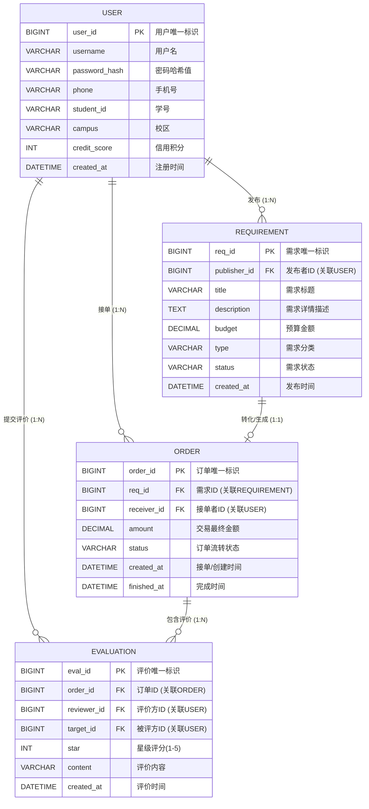

```mermaid
erDiagram
    %% 实体关系定义
    USER ||--o{ REQUIREMENT : "发布 (1:N)"
    USER ||--o{ ORDER : "接单 (1:N)"
    USER ||--o{ EVALUATION : "提交评价 (1:N)"
    REQUIREMENT ||--o| ORDER : "转化/生成 (1:1)"
    ORDER ||--o{ EVALUATION : "包含评价 (1:N)"

    %% 实体属性定义
    USER {
        BIGINT user_id PK "用户唯一标识"
        VARCHAR username "用户名"
        VARCHAR password_hash "密码哈希值"
        VARCHAR phone "手机号"
        VARCHAR student_id "学号"
        VARCHAR campus "校区"
        INT credit_score "信用积分"
        DATETIME created_at "注册时间"
    }

    REQUIREMENT {
        BIGINT req_id PK "需求唯一标识"
        BIGINT publisher_id FK "发布者ID (关联USER)"
        VARCHAR title "需求标题"
        TEXT description "需求详情描述"
        DECIMAL budget "预算金额"
        VARCHAR type "需求分类"
        VARCHAR status "需求状态"
        DATETIME created_at "发布时间"
    }

    ORDER {
        BIGINT order_id PK "订单唯一标识"
        BIGINT req_id FK "需求ID (关联REQUIREMENT)"
        BIGINT receiver_id FK "接单者ID (关联USER)"
        DECIMAL amount "交易最终金额"
        VARCHAR status "订单流转状态"
        DATETIME created_at "接单/创建时间"
        DATETIME finished_at "完成时间"
    }

    EVALUATION {
        BIGINT eval_id PK "评价唯一标识"
        BIGINT order_id FK "订单ID (关联ORDER)"
        BIGINT reviewer_id FK "评价方ID (关联USER)"
        BIGINT target_id FK "被评方ID (关联USER)"
        INT star "星级评分(1-5)"
        VARCHAR content "评价内容"
        DATETIME created_at "评价时间"
    }

```