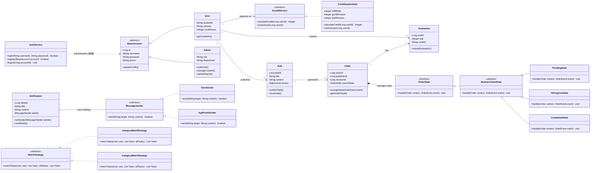

```mermaid
classDiagram
    direction LR

    %% ==================== 1. 用户与鉴权模块 (修复 SRP & LSP) ====================
    class AuthService {
        +login(String username, String password) boolean
        +register(BaseAccount account) boolean
        +logout(Long accountId) void
    }

    class BaseAccount {
        <<abstract>>
        -Long id
        -String username
        -String password
        -String phone
        +updateProfile()
    }

    class User {
        -String studentId
        -String campus
        -Integer creditScore
        +getCreditInfo()
    }

    class Admin {
        -String role
        -String department
        +auditUser()
        +manageContent()
        +handleReport()
    }

    %% 里氏替换原则 (LSP) 修复：User 和 Admin 共同继承基础账号，不再生硬嵌套
    BaseAccount <|-- User
    BaseAccount <|-- Admin
    AuthService ..> BaseAccount : authenticates (依赖)


    %% ==================== 2. 信用与评价模块 (修复 DIP) ====================
    class ICreditService {
        <<interface>>
        +calculateCredit(Long userId) Integer
        +restrictUser(Long userId)
    }

    class CreditSystemImpl {
        -Integer fulfillRate
        -Integer goodReviews
        -Integer badReviews
        +calculateCredit(Long userId) Integer
        +restrictUser(Long userId)
    }

    class Evaluation {
        -Long evalId
        -Integer star
        -String content
        +submitEvaluation()
    }

    %% 依赖倒转原则 (DIP) 修复：User 依赖接口而非具体实现
    ICreditService <|.. CreditSystemImpl
    User "1" --> "1" ICreditService : depends on
    User "1" --> "0..*" Evaluation : reviews


    %% ==================== 3. 消息通知模块 (修复 OCP) ====================
    class Notification {
        -Long notifyId
        -String title
        -String content
        -MessageSender sender
        +setSender(MessageSender sender)
        +sendNotify()
    }

    class MessageSender {
        <<interface>>
        +send(String target, String content) boolean
    }

    class SmsSender {
        +send(String target, String content) boolean
    }

    class AppPushSender {
        +send(String target, String content) boolean
    }

    %% 开闭原则 (OCP) 修复：新增通知渠道只需实现接口，无需修改 Notification 类
    Notification o-- MessageSender : uses strategy
    MessageSender <|.. SmsSender
    MessageSender <|.. AppPushSender


    %% ==================== 4. 订单与状态模块 (修复 ISP) ====================
    class Order {
        -Long orderId
        -Long publisherId
        -Long receiverId
        -OrderState currentState
        +changeState(OrderEvent event)
        +getOrderDetail()
    }

    class OrderState {
        <<interface>>
        +handle(Order context, OrderEvent event) void
    }

    %% 接口隔离原则 (ISP) 修复：使用抽象适配器类，避免末端状态被迫实现无关事件
    class AbstractOrderState {
        <<abstract>>
        +handle(Order context, OrderEvent event) void
    }

    class PendingState {
        +handle(Order context, OrderEvent event) void
    }
    class InProgressState {
        +handle(Order context, OrderEvent event) void
    }
    class CompletedState {
        +handle(Order context, OrderEvent event) void
    }

    OrderState <|.. AbstractOrderState
    AbstractOrderState <|-- PendingState
    AbstractOrderState <|-- InProgressState
    AbstractOrderState <|-- CompletedState
    Order *-- OrderState : manages state


    %% ==================== 5. 任务(需求)与匹配模块 (保留策略模式) ====================
    class Task {
        -Long taskId
        -String title
        -String content
        -BigDecimal reward
        +publishTask()
        +closeTask()
    }

    class MatchStrategy {
        <<interface>>
        +matchTasks(User user, List~Task~ allTasks) List~Task~
    }

    class CampusMatchStrategy {
        +matchTasks(User user, List~Task~ allTasks) List~Task~
    }
    
    class CategoryMatchStrategy {
        +matchTasks(User user, List~Task~ allTasks) List~Task~
    }

    %% 关联与策略模式
    MatchStrategy <|.. CampusMatchStrategy
    MatchStrategy <|.. CategoryMatchStrategy
    
    User "1" --> "0..*" Task : publishes
    Task "1" --> "0..1" Order : generates
    Order "1" --> "1" Evaluation : has

```