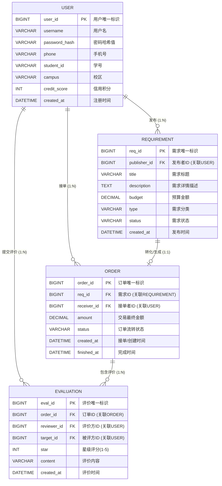

# Phase 3 详细设计文档 - CampusHub 校园互助系统
## 一、 类图设计与设计模式说明

### 1.1 核心类图

本系统采用模块化单体架构，核心类图涵盖了用户、需求、订单、评价及辅助模块，并针对 P2 阶段的架构逻辑进行了细化。

```mermaid
classDiagram
    direction LR

    %% 1. 用户与鉴权模块
    class AuthService {
        +login(String username, String password) boolean
        +register(BaseAccount account) boolean
        +logout(Long accountId) void
    }

    class BaseAccount {
        <<abstract>>
        -Long id
        -String username
        -String password
        -String phone
        +updateProfile()
    }

    class User {
        -String studentId
        -String campus
        -Integer creditScore
        +getCreditInfo()
    }

    class Admin {
        -String role
        -String department
        +auditUser()
        +manageContent()
        +handleReport()
    }

    BaseAccount <|-- User
    BaseAccount <|-- Admin
    AuthService ..> BaseAccount : authenticates

    %% 2. 信用与评价模块
    class ICreditService {
        <<interface>>
        +calculateCredit(Long userId) Integer
        +restrictUser(Long userId)
    }

    class CreditSystemImpl {
        -Integer fulfillRate
        -Integer goodReviews
        -Integer badReviews
        +calculateCredit(Long userId) Integer
        +restrictUser(Long userId)
    }

    class Evaluation {
        -Long evalId
        -Integer star
        -String content
        +submitEvaluation()
    }

    ICreditService <|.. CreditSystemImpl
    User "1" --> "1" ICreditService : depends on
    User "1" --> "0..*" Evaluation : reviews

    %% 3. 消息通知模块
    class Notification {
        -Long notifyId
        -String title
        -String content
        -MessageSender sender
        +setSender(MessageSender sender)
        +sendNotify()
    }

    class MessageSender {
        <<interface>>
        +send(String target, String content) boolean
    }

    class SmsSender {
        +send(String target, String content) boolean
    }

    class AppPushSender {
        +send(String target, String content) boolean
    }

    Notification o-- MessageSender : uses strategy
    MessageSender <|.. SmsSender
    MessageSender <|.. AppPushSender

    %% 4. 订单与状态模块
    class Order {
        -Long orderId
        -Long publisherId
        -Long receiverId
        -OrderState currentState
        +changeState(OrderEvent event)
        +getOrderDetail()
    }

    class OrderState {
        <<interface>>
        +handle(Order context, OrderEvent event) void
    }

    class AbstractOrderState {
        <<abstract>>
        +handle(Order context, OrderEvent event) void
    }

    class PendingState {
        +handle(Order context, OrderEvent event) void
    }

    OrderState <|.. AbstractOrderState
    AbstractOrderState <|-- PendingState
    Order *-- OrderState : manages state

    %% 5. 任务与匹配模块
    class Task {
        -Long taskId
        -String title
        -String content
        -BigDecimal reward
        +publishTask()
    }

    class MatchStrategy {
        <<interface>>
        +matchTasks(User user, List~Task~ allTasks) List~Task~
    }

    class CampusMatchStrategy {
        +matchTasks(User user, List~Task~ allTasks) List~Task~
    }

    MatchStrategy <|.. CampusMatchStrategy
    User "1" --> "0..*" Task : publishes
    Task "1" --> "0..1" Order : generates

```



### 1.2 设计模式应用

1. **状态模式 (State Pattern)**：应用于订单流转逻辑。通过 `OrderState` 接口及其具体实现类（如 `PendingState`）管理订单状态转换，避免了复杂的条件分支语句，提高了状态切换的可维护性。
2. **策略模式 (Strategy Pattern)**：应用于任务匹配（`MatchStrategy`）与消息通知（`MessageSender`）。系统可根据用户偏好灵活切换匹配策略，或根据配置动态选择通知渠道（如短信或 App 推送），实现了算法与使用的解耦。

---

## 二、 SOLID 原则检查清单

在设计过程中，团队对 AI 初始生成的类图进行了缺陷注入实验及 SOLID 原则审查，记录如下：

| SOLID 原则 | 检查问题 | AI 设计是否违反 | 违反说明 | 修正方案 |
| --- | --- | --- | --- | --- |
| S-单一职责 | 有没有类承担了过多职责？ | 是 | User 类作为领域实体（Entity），不仅包含了数据属性，竟然还包含了 register() 和 login() 这种复杂的业务身份认证逻辑，这是典型的“上帝类（God Class）”倾向。 | 将认证逻辑抽离。User 仅作为单纯的数据实体类（POJO/Entity）。新增 AuthService 类专门负责 register() 和 login() 等鉴权行为。 |
| O-开闭原则 | 新增需求类型是否需要修改现有代码？ | 是 | Notification 类中直接写死了 sendNotify() 方法。如果未来系统需要扩充通知渠道（比如新增短信通知、微信推送），就必须打开并修改这个类的源代码。 | 引入策略模式或抽象接口。将发送逻辑抽象为 MessageSender 接口，新增的具体通知渠道（如 SmsSender）只需实现该接口，无需修改 Notification 实体类。 |
| L-里氏替换 | 子类是否可以替换父类使用？ | 是 | Admin 直接继承了 User（Admin --> User）。但 User 包含 studentId（学号）、campus（校区）和 creditScore（信用分）。系统管理员根本不需要这些学生专属属性！如果用 Admin 替换 User 运行，调用 getCreditInfo() 会引发严重的逻辑错误。 | 破除 Admin 对 User 的生硬继承。应该抽象出一个更基础的 BaseAccount（仅包含 id, username, password 等共性），让 User 和 Admin 分别继承 BaseAccount。 |
| I-接口隔离 | 有没有接口太“胖”，包含了不需要的方法？ | 是 | OrderState 接口定义了统一的 handle(..., OrderEvent event)。这意味着像 CanceledState（已取消状态）这种终态，也被迫去面对和处理 ACCEPT（接单）或 SUBMIT_EVIDENCE 等与它毫无关系的枚举事件，导致内部出现大量冗余的判断或空实现。 | 不强制所有状态处理所有事件。可以将状态处理逻辑进一步拆分，或者在 P2 设计的 事件驱动状态机引擎 中统一拦截非法事件，避免让末端状态类背负不属于它的事件处理压力。 |
| D-依赖倒转 | 高层模块是否直接依赖了低层模块的具体实现？ | 是 | User 直接关联并依赖了具体的 CreditSystem 类（User "1" --> "1" CreditSystem）。如果未来学校要求接入第三方信用系统（如芝麻信用或教务处学分系统），高层模块将面临大改。 | 面向接口编程。定义一个 ICreditService 接口，让 User 依赖于该接口，而 CreditSystem 作为底层模块去实现这个接口。 |


---

## 三、 API 设计规范
### **3.1 全局规范定义**

#### **3.1.1 统一响应结构**

系统所有 API 接口（无论请求成功与否）均采用统一的 JSON 包装格式进行返回：

```JSON

{  
  "code": 200,  
  "message": "success",  
  "data": {}   
}
```

* code: 业务状态码（200 表示成功，非 200 表示各类业务或系统异常）。  
* message: 提示信息，可直接用于前端弹窗展示。  
* data: 实际业务载荷数据。请求失败时，此字段可为 null 或空对象。

#### **3.1.2 全局错误码字典**

| 错误码 | 描述说明 | 触发场景说明 |
| :---- | :---- | :---- |
| 200 | 请求成功 | 正常返回 |
| 400 | 参数校验失败 | 必填项为空、格式不合法、长度越界等 |
| 401 | 未认证或凭证失效 | 未携带 Token 或 Token 已过期 |
| 403 | 无权限操作 | 尝试操作不属于当前用户的资源 |
| 404 | 资源不存在 | 查询的订单、需求或用户 ID 不存在 |
| 500 | 服务端异常 | 数据库连接失败、运行时未知错误等 |

---

### **3.2 核心业务接口**

#### **3.2.1 用户登录**

* **URL 路径:** /api/v1/auth/login  
* **HTTP 方法:** POST  
* **安全认证:** 不需要

**请求参数 (Body):**

| 字段 | 类型 | 必填 | 说明 |
| :---- | :---- | :---- | :---- |
| username | String | 是 | 用户名或学号，长度 4-20 位 |
| password | String | 是 | 用户密码（前端需进行 SHA256 加密后传输） |

**响应格式示例 (成功):**

```JSON

{  
  "code": 200,  
  "message": "登录成功",  
  "data": {  
    "userId": "10086",  
    "token": "eyJhbGciOiJIUzI1NiIsInR5cCI6..."  
  }  
}
```

**响应格式示例 (失败 - 密码错误):**

```JSON
{
  "code": 400,
  "message": "用户名或密码错误",
  "data": null
}
```

#### **3.2.2 发布需求**

* **URL 路径:** /api/v1/requirements  
* **HTTP 方法:** POST  
* **安全认证:** 需要 Header 携带 Authorization: Bearer \<token\>

**请求参数 (Body):**

| 字段 | 类型 | 必填 | 说明 |
| :---- | :---- | :---- | :---- |
| title | String | 是 | 需求标题，限 5-50 字符 |
| description | String | 是 | 需求详细描述，限 500 字符 |
| budget | Decimal | 是 | 预算金额，必须 \>= 0 |
| type | String | 是 | 需求分类枚举（如 EXPRESS, TUTORING） |

**响应格式示例 (成功):**

```JSON

{  
  "code": 200,  
  "message": "发布成功",  
  "data": {  
    "reqId": "REQ_992103"  
  }  
}
```
**响应格式示例 (失败 - 预算金额为负数等参数校验失败):**

```JSON
{
  "code": 400,
  "message": "预算金额必须大于等于0",
  "data": null
}
```

#### **3.2.3 浏览需求列表（含筛选）**

* **URL 路径:** /api/v1/requirements  
* **HTTP 方法:** GET  
* **安全认证:** 需要 Header 携带 Authorization: Bearer \<token\>

**请求参数 (Query):**

| 字段 | 类型 | 必填 | 说明 |
| :---- | :---- | :---- | :---- |
| keyword | String | 否 | 标题或描述的模糊搜索词 |
| status | String | 否 | 状态筛选（如 PENDING 待接单） |
| page | Integer | 否 | 当前页码，默认 1 |
| pageSize | Integer | 否 | 每页数量，默认 10，最大 50 |

**响应格式示例 (成功):**

```JSON

{  
  "code": 200,  
  "message": "success",  
  "data": {  
    "total": 150,  
    "list": [  
      {  
        "reqId": "REQ_992103",  
        "title": "求代拿快递",  
        "budget": 5.00,  
        "status": "PENDING"  
      }  
    ]  
  }  
}
```

**响应格式示例 (失败 - Token 失效或未携带):**

```JSON
{
  "code": 401,
  "message": "登录凭证已过期，请重新登录",
  "data": null
}
```


#### **3.2.4 接单 (基于需求创建订单)**

* **URL 路径:** /api/v1/orders  
* **HTTP 方法:** POST  
* **安全认证:** 需要 Header 携带 Authorization: Bearer \<token\>

**请求参数 (Body):**

| 字段 | 类型 | 必填 | 说明 |
| :---- | :---- | :---- | :---- |
| reqId | String | 是 | 想要接单的需求 ID |

**专属错误码:**

* 4001: 该需求已被他人接单。  
* 4002: 发布者不可接取自身发布的需求。

**响应格式示例 (成功):**

```JSON

{  
  "code": 200,  
  "message": "接单成功",  
  "data": {  
    "orderId": "ORD_558291"  
  }  
}
```
**响应格式示例 (失败 - 需求已被抢单):**

```JSON
{
  "code": 4001,
  "message": "手慢了，该需求已被他人接取",
  "data": null
}
```

#### **3.2.5 查看订单详情**

* **URL 路径:** /api/v1/orders/{orderId}  
* **HTTP 方法:** GET  
* **安全认证:** 需要 Header 携带 Authorization: Bearer \<token\>

**请求参数 (Path):**

| 字段 | 类型 | 必填 | 说明 |
| :---- | :---- | :---- | :---- |
| orderId | String | 是 | 订单的唯一标识 ID |

**响应格式示例 (成功):**

```JSON

{  
  "code": 200,  
  "message": "success",  
  "data": {  
    "orderId": "ORD_558291",  
    "reqId": "REQ_992103",  
    "publisherId": "10086",  
    "receiverId": "10087",  
    "amount": 5.00,  
    "currentState": "IN_PROGRESS"  
  }  
}
```

**响应格式示例 (失败 - 订单不存在):**

```JSON

{
  "code": 404,
  "message": "查询的订单不存在",
  "data": null
}
```

#### **3.2.6 提交评价**

* **URL 路径:** /api/v1/orders/{orderId}/evaluations  
* **HTTP 方法:** POST  
* **安全认证:** 需要 Header 携带 Authorization: Bearer \<token\>

**请求参数 (Body):**

| 字段 | 类型 | 必填 | 说明 |
| :---- | :---- | :---- | :---- |
| star | Integer | 是 | 评分星级，限制 1 到 5 之间的整数 |
| content | String | 否 | 文字评价内容，限 200 字符内 |


**响应格式示例 (成功):**

```JSON
{
  "code": 200,
  "message": "评价提交成功",
  "data": null
}
```

**响应格式示例 (失败 - 订单不存在):**

```JSON
{
  "code": 4003,
  "message": "订单尚未完成，暂不可提交评价",
  "data": null
}
```

**专属错误码:**

* 4003: 订单当前状态不可评价（如处于未完成状态）。  
* 4004: 当前操作用户非该订单的参与者，无权评价。

---

### **3.3 AI 辅助审查与缺陷发现报告**

在生成 API 规范文档的过程中，团队首先要求 AI 输出初始版本。经团队人工介入审查，发现 AI 的初始设计存在以下典型缺陷。团队已在上述最终版规范中完成了修正：

1. **接口命名不一致：**  
   * **发现缺陷：** AI 初始生成的路径混用了动词与名词（如 /getRequirements 与 /createOrder），且未统一大小写规范。  
   * **修正方案：** 强制统一采用 RESTful 风格，路径仅使用名词复数。例如获取需求列表修正为 GET /requirements，发布需求修正为 POST /requirements，通过 HTTP Method 区分具体动作。  
2. **缺少错误处理：**  
   * **发现缺陷：** 初始文档仅定义了 HTTP 200 的成功返回结构，未对业务异常、并发冲突等场景进行错误码定义。  
   * **修正方案：** 在文档全局预定义了统一的响应外壳（包含 code, message, data），并补充了全局错误码表。针对接单等复杂业务，额外追加了 4001（需求已被接）、4003（不可评价）等具体业务级错误码。  
3. **参数校验不完整：**  
   * **发现缺陷：** 初始参数表仅列出参数名与类型，缺乏对边界条件的约束。  
   * **修正方案：** 补充了严格的参数边界说明。例如约束 budget \>= 0、限制评价 star 在 1-5 之间、规定 username 与 description 的字符长度上下限。  
4. **安全问题（未考虑认证）：**  
   * **发现缺陷：** 初始文档未体现鉴权逻辑，任意接口均可匿名调用，存在严重的越权风险。  
   * **修正方案：** 明确了各接口的安全级别。除登录/注册接口外，强制规定所有核心业务接口请求时必须在 HTTP Header 中携带 Authorization: Bearer \<token\> 凭证。
---

## 四、 数据库设计

### 4.1 ER 图

系统核心实体包括 `USER`、`REQUIREMENT`、`ORDER` 及 `EVALUATION`。

* **USER** 与 **REQUIREMENT**: 1:N 关系（发布）。
* **REQUIREMENT** 与 **ORDER**: 1:1 关系（生成）。
* **ORDER** 与 **EVALUATION**: 1:N 关系（双向评价）。


### 4.2 建表 SQL 与索引设计
#### **4.2.1 隐私数据处理规范**

在进行底层建表之前，针对系统中的敏感信息确立以下存储与加密规范：

1. **密码存储：** 绝对禁止明文存储密码。系统采用 bcrypt 或 Argon2 算法对密码进行加盐哈希（Hash）处理后存储至 password\_hash 字段。该过程不可逆，即使数据库泄露也无法还原真实密码。  
2. **手机号处理：** 手机号码属于敏感个人信息（PII）。系统采用对称加密算法（如 AES-256-CBC）对手机号进行加密后存储至 phone\_encrypted 字段。只有在需要向用户发送通知或进行实名校验时，才在后端内存中进行解密，避免数据库层面的明文暴露。
#### **4.2.2 核心数据表创建语句**
```sql
-- 1. 创建并使用系统专属数据库
CREATE DATABASE IF NOT EXISTS `campushub_db` DEFAULT CHARACTER SET utf8mb4 COLLATE utf8mb4_0900_ai_ci;
USE `campushub_db`;

-- 2. 清理历史表结构（注意顺序：先删有关联外键逻辑的子表，再删父表）
DROP TABLE IF EXISTS `biz_evaluation`;
DROP TABLE IF EXISTS `biz_order`;
DROP TABLE IF EXISTS `biz_requirement`;
DROP TABLE IF EXISTS `sys_user`;

-- 3. 创建核心表

-- 用户基础信息表
CREATE TABLE `sys_user` (
  `user_id` BIGINT NOT NULL COMMENT '用户唯一标识，雪花算法生成',
  `username` VARCHAR(64) NOT NULL COMMENT '用户名',
  `password_hash` VARCHAR(255) NOT NULL COMMENT '加盐哈希密码',
  `phone_encrypted` VARCHAR(255) NOT NULL COMMENT '加密后的手机号',
  `student_id` VARCHAR(32) NOT NULL COMMENT '学号',
  `campus` VARCHAR(64) DEFAULT NULL COMMENT '校区',
  `credit_score` INT NOT NULL DEFAULT 100 COMMENT '信用积分，初始100',
  `created_at` DATETIME NOT NULL DEFAULT CURRENT_TIMESTAMP COMMENT '注册时间',
  `updated_at` DATETIME NOT NULL DEFAULT CURRENT_TIMESTAMP ON UPDATE CURRENT_TIMESTAMP COMMENT '更新时间',
  PRIMARY KEY (`user_id`),
  UNIQUE KEY `uk_username` (`username`),
  UNIQUE KEY `uk_student_id` (`student_id`)
) ENGINE=InnoDB DEFAULT CHARSET=utf8mb4 COLLATE=utf8mb4_0900_ai_ci COMMENT='用户基础信息表';

-- 需求信息表
CREATE TABLE `biz_requirement` (
  `req_id` BIGINT NOT NULL COMMENT '需求唯一标识',
  `publisher_id` BIGINT NOT NULL COMMENT '发布者用户ID',
  `title` VARCHAR(128) NOT NULL COMMENT '需求标题',
  `description` TEXT NOT NULL COMMENT '需求详情描述',
  `budget` DECIMAL(10,2) NOT NULL DEFAULT '0.00' COMMENT '预算金额，精确到分',
  `type` VARCHAR(32) NOT NULL COMMENT '需求分类枚举值',
  `status` VARCHAR(32) NOT NULL DEFAULT 'PENDING' COMMENT '需求状态：PENDING, ACCEPTED, COMPLETED, CANCELED',
  `created_at` DATETIME NOT NULL DEFAULT CURRENT_TIMESTAMP COMMENT '发布时间',
  `updated_at` DATETIME NOT NULL DEFAULT CURRENT_TIMESTAMP ON UPDATE CURRENT_TIMESTAMP COMMENT '更新时间',
  PRIMARY KEY (`req_id`),
  KEY `idx_publisher_id` (`publisher_id`),
  KEY `idx_status_created` (`status`, `created_at`)
) ENGINE=InnoDB DEFAULT CHARSET=utf8mb4 COLLATE=utf8mb4_0900_ai_ci COMMENT='需求信息表';

-- 交易订单表
CREATE TABLE `biz_order` (
  `order_id` BIGINT NOT NULL COMMENT '订单唯一标识',
  `req_id` BIGINT NOT NULL COMMENT '关联的需求ID',
  `receiver_id` BIGINT NOT NULL COMMENT '接单者用户ID',
  `amount` DECIMAL(10,2) NOT NULL COMMENT '交易最终金额',
  `status` VARCHAR(32) NOT NULL DEFAULT 'IN_PROGRESS' COMMENT '订单状态：IN_PROGRESS, TO_CONFIRM, COMPLETED, CANCELED',
  `created_at` DATETIME NOT NULL DEFAULT CURRENT_TIMESTAMP COMMENT '接单/创建时间',
  `finished_at` DATETIME DEFAULT NULL COMMENT '订单完成时间',
  PRIMARY KEY (`order_id`),
  UNIQUE KEY `uk_req_id` (`req_id`),
  KEY `idx_receiver_id` (`receiver_id`),
  KEY `idx_status` (`status`)
) ENGINE=InnoDB DEFAULT CHARSET=utf8mb4 COLLATE=utf8mb4_0900_ai_ci COMMENT='交易订单表';

-- 订单评价表
CREATE TABLE `biz_evaluation` (
  `eval_id` BIGINT NOT NULL COMMENT '评价唯一标识',
  `order_id` BIGINT NOT NULL COMMENT '关联的订单ID',
  `reviewer_id` BIGINT NOT NULL COMMENT '评价方用户ID',
  `target_id` BIGINT NOT NULL COMMENT '被评价方用户ID',
  `star` TINYINT NOT NULL COMMENT '星级评分(1-5)',
  `content` VARCHAR(500) DEFAULT NULL COMMENT '文字评价内容',
  `created_at` DATETIME NOT NULL DEFAULT CURRENT_TIMESTAMP COMMENT '评价时间',
  PRIMARY KEY (`eval_id`),
  KEY `idx_target_id` (`target_id`),
  KEY `idx_order_id` (`order_id`)
) ENGINE=InnoDB DEFAULT CHARSET=utf8mb4 COLLATE=utf8mb4_0900_ai_ci COMMENT='订单评价表';

```
#### **4.2.3 索引设计说明**

在上述建表语句中，除了主键索引外，我们针对高频查询场景设计了以下二级索引：

1. **唯一索引 (Unique Key):**  
   * uk\_username 与 uk\_student\_id (用户表): 保证登录账号和学号在系统中的全局唯一性，同时极大提升登录时的查询速度。  
   * uk\_req\_id (订单表): 强制保证一个需求最多只能生成一个订单，在数据库底层防止并发导致的“一单多接”问题。  
2. **普通单列索引 (Normal Key):**  
   * idx\_publisher\_id (需求表) 与 idx\_receiver\_id (订单表): 用户中心需要高频查询“我发布的”和“我接取的”数据，为用户 ID 建立索引可避免全表扫描。  
   * idx\_target\_id (评价表): 用于快速统计某个用户（被评价方）的历史平均星级和好评率。  
   * idx\_order\_id (评价表): 用于在查看订单详情时，快速拉取该订单关联的评价信息。  
3. **联合索引 (Composite Key):**  
   * idx\_status\_created (需求表): 需求大厅的核心查询场景是“按状态（如待接单）拉取最新发布的需求”。依据最左前缀法则，该联合索引能同时满足对 status 的等值查询以及对 created\_at 的排序，有效避免了 Using filesort（文件排序）导致的性能瓶颈。